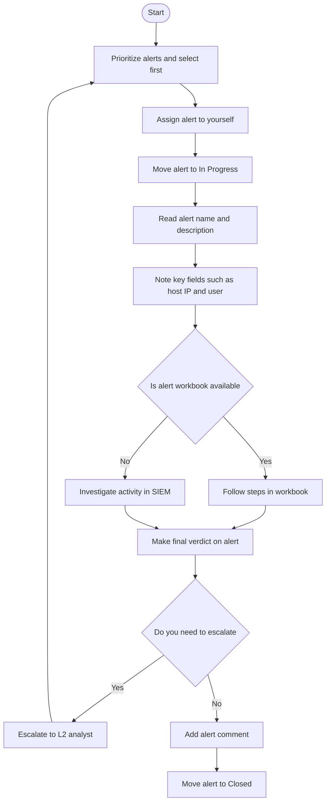

## Event

An **EVENT** is an action like:

- User login  
- Process launch  
- File download  

The system (OS / Firewall / Cloud) logs each event.

Logged events are stored in security solutions like:

- SIEM  
- EDR  
- NDR  
- SOAR  
- ITSM  

# Security Solutions

| Solution | Examples | Description |
|---|---|---|
| **SIEM System** | Splunk ES, Elastic | SIEM have solid alert management capabilities and are a perfect choice for most SOC teams |
| **EDR or NDR** | MS Defender, CrowdStrike | While EDR and NDR provide their own alert dashboards, it is preferred to use SIEM or SOAR |
| **SOAR System** | Splunk SOAR, Cortex SOAR | Bigger SOC teams can use SOAR to aggregate and centralise alerts from multiple solutions |
| **ITSM System** | Jira, TheHive | Some teams may have a custom ticket management (ITSM) setup using a dedicated solution |

---

## Alert
When an unexpected event is logged, an **ALERT** is generated by the security solution.

> This process saves SOC analysts from reading millions of logs each day.

---

# Properties of Alert

| № | Property | Description | Examples |
|---|---|---|---|
| 1 | Alert Time | Shows alert creation time. Alert usually triggers a few minutes after the actual event | Alert Time: March 21, 15:35   Event Time: March 21, 15:32 |
| 2 | Alert Name | Provides a summary of what happened, based on the detection rule's name | Unusual Login Location   Email Marked as Phishing   Windows RDP Bruteforce   Potential Data Exfiltration |
| 3 | Alert Severity | Defines the urgency of the alert, initially set by detection engineers, but can be altered by analysts if needed | Low / Informational   Medium / Moderate   High / Severe   Critical / Urgent |
| 4 | Alert Status | Informs if somebody is working on the alert or if the triage is done | New / Unassigned   In Progress / Pending   Closed / Resolved |
| 5 | Alert Verdict | Also called alert classification, explains if the alert is a real threat or noise | True Positive / Real Threat   False Positive / No Threats |
| 6 | Alert Assignee | Shows the analyst that was assigned or assigned themselves to review the alert | Assignee can sometimes be called alert owner |
| 7 | Alert Description | Explains what the alert is about | Logic of the alert generating rule   Why this activity can indicate an attack   Optionally how to triage this alert |
| 8 | Alert Fields | Provides SOC analysts comments and values on which alert was triggered | Affected Hostname   Entered Commandline   And many more depending on the alert |

---

# Alert Triage Workflow

---

# Alert Report Format

Alert report should answer this question to follow this structure:

- **Who** — Which user logs in, runs the command, or downloads the file  
- **What** — What exact action or event sequence was performed  
- **When** — When exactly did the suspicious activity start and ended  
- **Where** — Which device, IP, or website was involved in the alert  
- **Why** — The most important W, the reasoning for your final verdict
