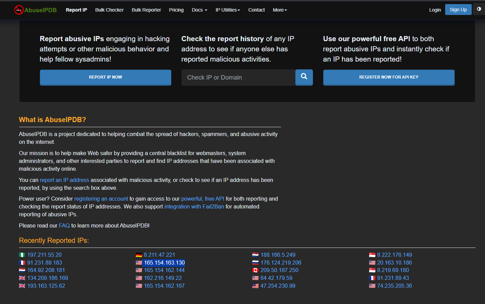
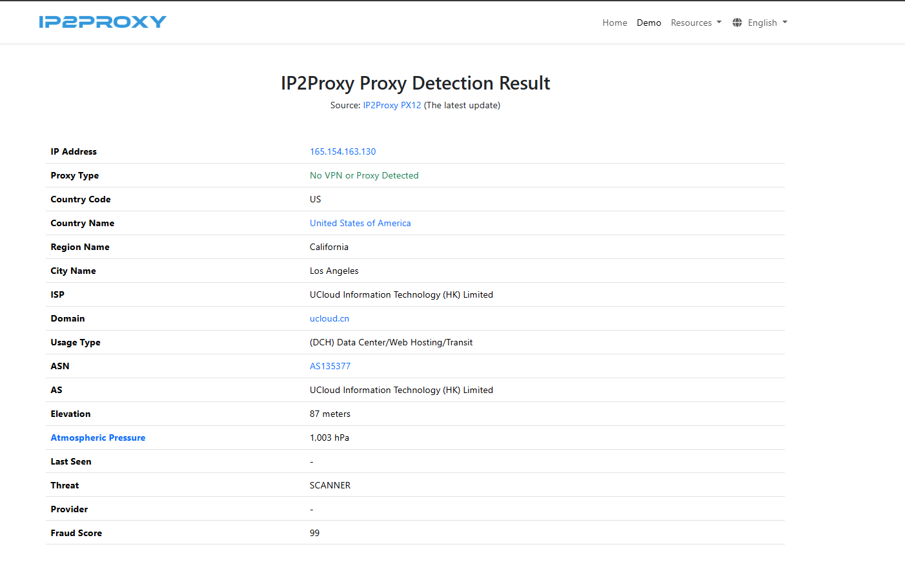

## Anonymization service
An anonymization service is anything that helps a user mask their real location or identity online.
-  Common examples:
-	VPN providers
-	Proxy servers
-	Tor exit nodes
-	Hosting-based relay servers
-  Attackers frequently use these to:
-	Hide their real origin
-	Bypass geolocation restrictions
-	Avoid attribution
-	Launch attacks anonymously
-  But important:
-	Not all anonymization is malicious.
-	Plenty of legitimate users use VPNs.

----

# What Anonymization Detection Services Do
These services analyze IPs and classify them as:
-	VPN IP
-	Proxy IP
-	Tor exit node
-	Hosting provider
-	Residential IP
-	Mobile carrier IP
Examples of anonymization detection providers (commonly integrated into security tools):
-	IPQualityScore
-	IP2Proxy
-	MaxMind
-	Spur
-	Scamalytics
They look at:
-	ASN patterns
-	Known VPN ranges
-	Hosting infrastructure
-	Traffic behavior
-	Known Tor node lists

----

# Why This Matters in SOC
If an alert shows:
Login attempt from an IP classified as “VPN / Proxy / Hosting Provider”
That increases suspicion because:
-	Legitimate employees usually log in from residential or corporate ISP IPs.
-	Attackers often use VPN or cloud infrastructure.
It doesn’t prove compromise.
But it increases risk scoring.

----

## Demo:
Let’ s take a malicious Ip from (abuse Ip ) and pretend that’s the alert Ip that we got.

Checking that IP in IP2Proxy:

1.	Proxy Type: No VPN or Proxy Detected
- This means:
  -	It is not identified as a consumer VPN.
  -	It is not flagged as a Tor exit node.
  -	It is not classified as a residential proxy.
- This does not mean it is safe.
- It just means it’s not a traditional anonymity service like NordVPN or Tor.

2.	Usage Type: (DCH) Data Center / Web Hosting / Transit
- It tells us:
  -	This IP belongs to a data center / hosting provider.
  -	UCLOUD infrastructure.
- In SOC terms:
  -	Hosting infrastructure = higher abuse probability than residential ISP.

3.	ASN: AS135377
4.	AS: UCLOUD Information Technology (HK) Limited
  -	Matches registry data.
  -	That strengthens consistency across intelligence sources.

5.	Threat: SCANNER
-	This is critical.
-	This means: The IP has behavior consistent with scanning activity.
-	Scanning typically includes:
  -  Port scanning
  -  Service enumeration
  -  Reconnaissance
  -  Credential brute-force attempts

6.	Fraud Score: 99
-	That’s extremely high.
-	Most scoring systems use 0 - 100.
-	99 suggests: Very high probability of abusive or automated activity.
-	This is strong corroborating evidence.

